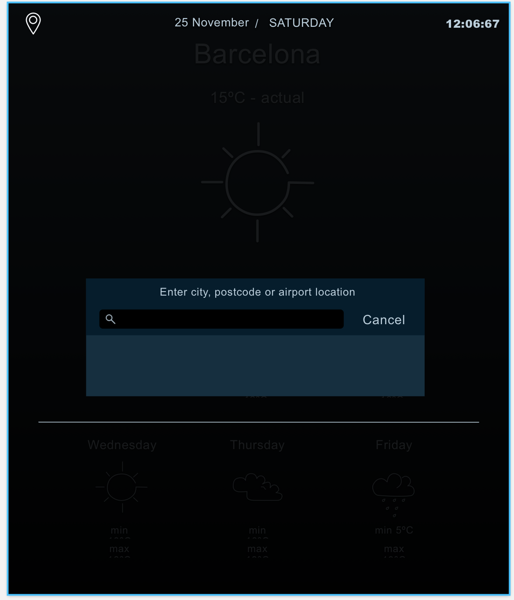

# Weather app project.
Using React-js create a weather app according to the following requirements.

### Requirements:
* It needs to auto detect the current location using geolocation and display the current weather based on that by default.
* Users must be able to change location using an input field.
* The input field must use google autocomplete to suggest the city while typing.
* it should display the weather for 7 days.
* it should be responsive, looking reasonable both on a laptop and a mobile phone.
* You must follow the provided design.
* You can use any API of your choice.
* You can use a css pre-processor like Sass, LESS or others.
* All submission must be done in the form of a public git repository, and you need to be committing and pushing from the very beginning, not just work completely locally and then push it once is finished.
Feel free to use the Version Control Hosting of your choice. (Github, GitLab, Bitbucket etc...)

#### Plus:
* Using ES6/ES7.
* Using a css pre-processor.
* Clean and DRY code.
* A detailed and clear readme file.

#### Extras:
* Adding the possibility to save favourite cities using a DB or local storage.
* Unit testing

### Design

